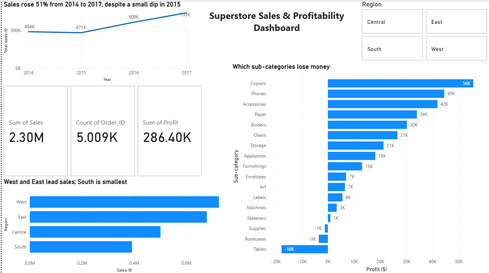

# Superstore Sales & Profitability Analysis

End-to-end data analyst capstone project: cleaning, exploring, and analyzing the
Superstore retail dataset (9,994 orders, 2014–2017) using Excel, SQL, and Power BI,
to identify why strong sales weren't translating into proportional profit.

## Repo structure

```
superstore-capstone/
├── README.md                  <- this file
├── data/
│   ├── raw/                   <- original, unmodified source file
│   └── cleaned/                <- cleaned dataset (.xlsx and .csv)
├── sql/
│   ├── superstore_import.sql  <- creates the `orders` table and loads all rows
│   └── analysis_queries.sql   <- the analysis queries used for key findings
├── excel/                     <- add your PivotTable workbook here
└── powerbi/                   <- add your .pbix file (and/or dashboard screenshot) here
```

## Process

1. **Data cleaning (Python/Excel):** Identified and resolved a date-parsing
   inconsistency affecting 1,708 rows (17% of the dataset) where Ship Date appeared
   before Order Date due to inconsistent date formatting in the source file.
   Standardized column names and added derived fields (`Shipping_Days`,
   `Profit_Margin`, `Order_Year`, `Order_Month`).
2. **Excel exploration:** Built PivotTables for Sales by Region and Profit by
   Category/Sub-Category to establish baseline patterns.
3. **SQL analysis (MySQL):** Queried profitability by sub-category and discount
   band to isolate the root cause of losses (see `sql/analysis_queries.sql`).
4. **Power BI dashboard:** Built an interactive dashboard with KPIs, regional
   sales, sub-category profitability, and sales trend/seasonality visuals.

## Key Findings

1. **Three sub-categories are unprofitable overall:** Tables (-$17,725), Bookcases
   (-$3,473), and Supplies (-$1,189) — despite Furniture and Office Supplies being
   large, high-revenue categories.
2. **Root cause identified via SQL:** Tables are profitable at 0% discount
   (+$13,276), but flip to a steep loss once *any* discount is applied. The
   21–40% discount band alone accounts for -$19,590 in losses — the single
   largest driver of Tables' unprofitability.
3. **Regional performance:** West and East regions lead in total sales, with
   South consistently the smallest contributor.
4. **Seasonality:** Sales show a repeating monthly pattern with predictable
   spikes (e.g., September, November), alongside steady year-over-year growth.

## Recommendations

- **Cap or eliminate discounts on Tables**, particularly above 20% — this could
  recover an estimated $30,000+ in profit based on current loss patterns.
- **Review pricing/cost structure for Bookcases and Supplies**, which show
  similar (smaller-scale) discount sensitivity.
- **Plan inventory and staffing around identified seasonal peaks** rather than
  treating demand as flat.

## How to reproduce

1. Import `data/cleaned/superstore_cleaned.csv` into Excel for PivotTable
   exploration.
2. In MySQL, run `sql/superstore_import.sql` to create and populate the
   `orders` table, then run `sql/analysis_queries.sql` for the analysis.
3. In Power BI Desktop, connect to `data/cleaned/superstore_cleaned.xlsx`
   (or the MySQL `orders` table) and rebuild the dashboard visuals described
   above.

## Tools used
Python (pandas, for cleaning) · Microsoft Excel (PivotTables) · MySQL Workbench
(SQL analysis) · Power BI Desktop (dashboard)
