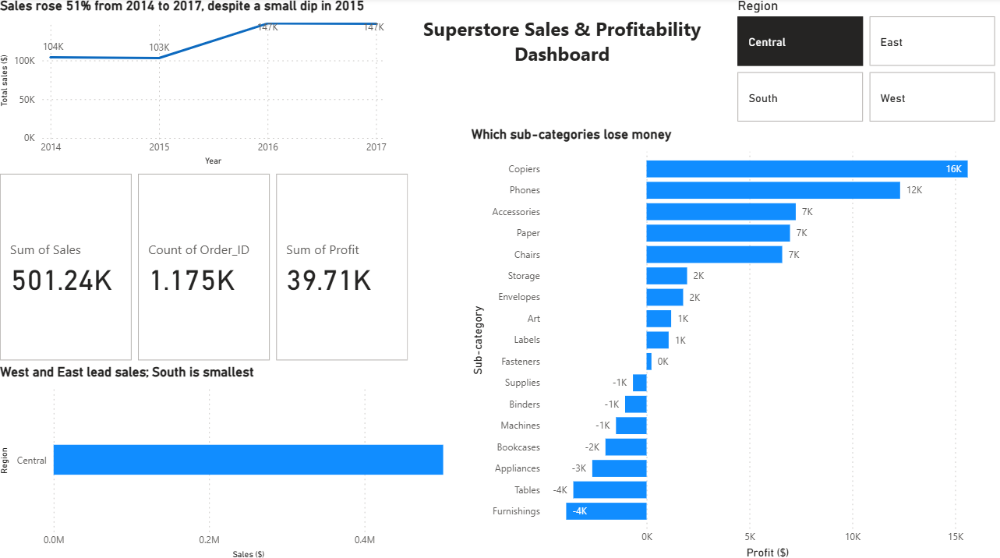

# Superstore Sales & Profitability Analysis

**Interactive dashboard: the Region slicer filtered to Central** (cards, charts and region bar update with the filter)

## Business question
Where does Superstore make and lose money, and does the discount level explain the losses?

## Key findings
- **Sales grew 51% from 2014 to 2017** ($484K to $733K), with a small dip in 2015.
- **Discounts above 20% wipe out profit:** the 21-40% band lost $35,817 and the 40%+ band lost $99,559.
- **Tables, Bookcases and Supplies lose money overall.**
- **West earns the best margin (14.9%) and Central the lowest (7.9%).**
- **Sales are seasonal:** November, December and September are the strongest months, and Q4 brings in about 38% of sales.
- **Recommendation:** cap discounts at 20%. This shows correlation, not proof of cause.

## Data
Sample Superstore, 2014-2017: 9,994 order lines and 5,009 orders. Total profit $286,397.02 (reconciled in Excel, MySQL and Power BI).

**Cleaning:** some dates were read with month and day swapped (5,201 rows affected). They were fixed and checked: every shipping time is now 0 to 7 days. Postal codes were restored to 5 digits, odd spaces were removed, and analysis columns were added.

## Tools
Excel (cleaning and PivotTables), MySQL (queries), Power BI (dashboard).

## Folder guide
- `data/`: cleaned dataset (`superstore_for_mysql.csv`)
- `sql/`: `superstore_import.sql` (creates and loads the table) and `analysis_queries.sql` (analysis, JOIN, outlier check)
- **Note:** `regional_managers` is a small reference table created to demonstrate a SQL JOIN. The manager names are placeholders.
- `excel/`: PivotTable dashboard
- `powerbi/`: Power BI dashboard (.pbix)
- `report/`: written report (PDF and Word)
- 
- - Screenshots in the repo root: `dashboard_screenshot.png` (full dashboard), `dashboard_slicer_central.png` (slicer filtered to Central), `pivot_tables_combined.png` (Excel PivotTables)

## How to run
1. Run `sql/superstore_import.sql`. Edit the file path in the `LOAD DATA` line first.
2. Run `sql/analysis_queries.sql`.
3. Open the `.pbix` file in Power BI Desktop.
